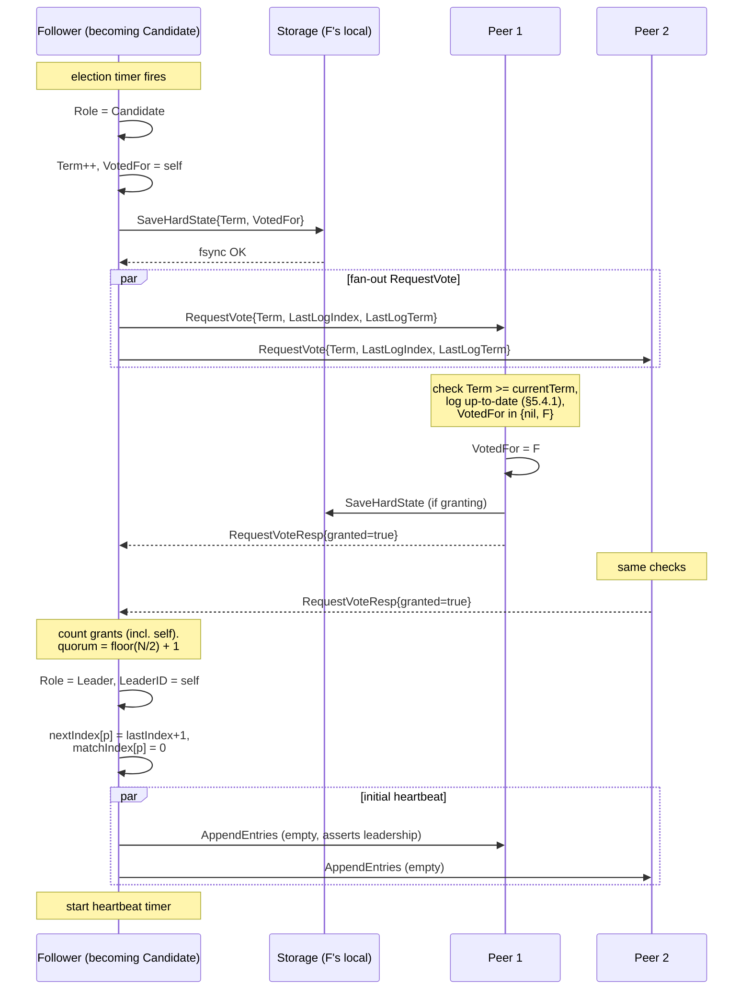
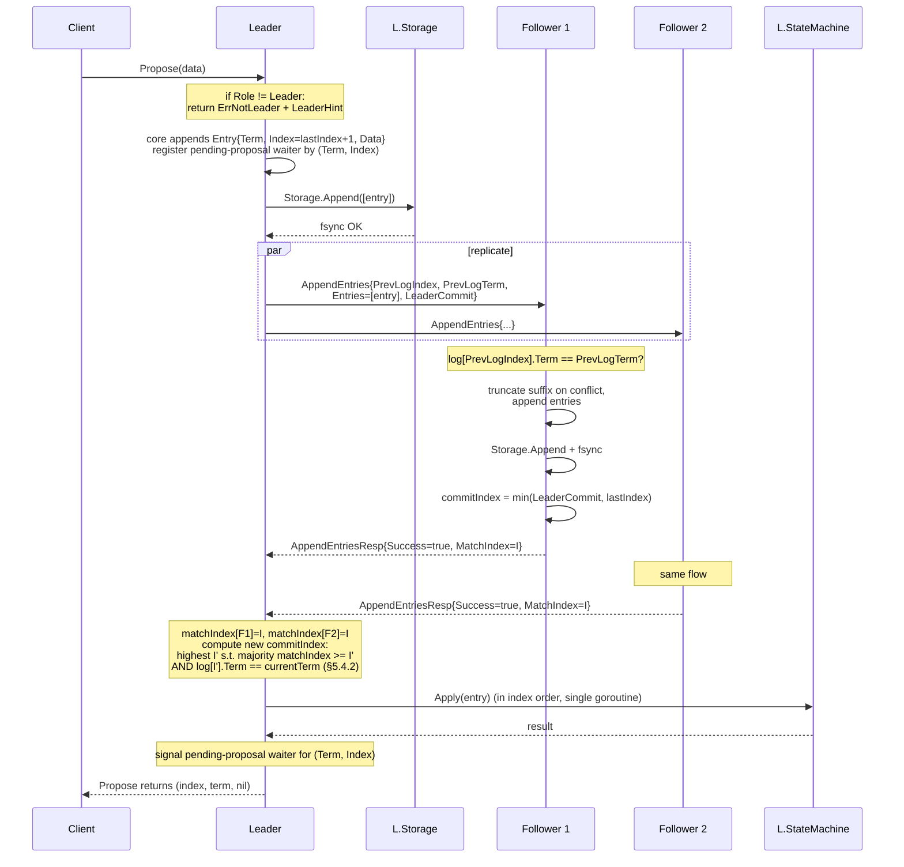

# ToyRaft — Sequence Flows

**Status:** Accepted (Phase 1 contract)
**Date:** 2026-06-18
**Scope:** the three load-bearing data paths — election, client write, heartbeat / catch-up

Sourced from `.planning/research/ARCHITECTURE.md` (§Data Flow — Election, §Data Flow — Client Write, §Data Flow — Heartbeat / Log Catch-up). Diagrams render natively on GitHub via Mermaid; no toolchain required.

This document captures **the wire-level interaction order** for the three flows where most Raft bugs live. Each diagram is followed by a short failure-mode addendum (what goes wrong when X). For the architectural decomposition, see `docs/HLD.md`. For the JSON envelopes, see `docs/WIRE.md` (lands later in this phase).

---

## 1. Election sequence

**Trigger:** Follower's election timer expires without hearing a valid `AppendEntries` from the current term's leader.



**Failure modes:**

- **Split vote** — no candidate reaches quorum within the next election timeout. All candidates restart with `Term++`. Randomised `ElectionTick` keeps re-collisions rare.
- **Higher term observed** — any RPC carrying `Term > currentTerm` triggers uniform `maybeStepDown` to Follower, persist new term + clear `VotedFor`.
- **Stale candidate's log** — peer denies vote if its own `(LastLogTerm, LastLogIndex)` is more up-to-date (Raft §5.4.1, election restriction). Candidate may lose every vote despite being responsive.
- **HardState fsync stall** — slow storage delays the `RequestVote` fan-out, which can extend the election timeout window and trigger a re-election. Storage SLO matters here, not just throughput.

**Invariant:** `HardState{Term, VotedFor}` MUST be fsynced **before** sending the corresponding `RequestVote` or vote-granting `RequestVoteResp`. The driver enforces this — core only emits messages via `Ready{}`, and the driver persists, then sends.

Source: `ARCHITECTURE.md` §Data Flow — Election.

---

## 2. Client write sequence

**Trigger:** Consumer calls `node.Propose(ctx, data)` on a node it *hopes* is leader.



**Failure modes:**

- **Leader loses leadership before commit** — waiter is woken with `ErrProposalDropped`. Client retries against the new leader (using `LeaderHint`).
- **Follower log conflict** — AppendEntries returns `Success=false` + `ConflictTerm/ConflictIndex`. Leader decrements `nextIndex[F]` and retries; see the catch-up flow below.
- **Minority-partition leader** — leader keeps proposing but never gets quorum. `Propose` blocks until `ctx` expires or step-down happens; returns `ErrTimeout` or `ErrProposalDropped`.
- **Follower fsync stall** — a single slow follower does NOT block commit (quorum = majority). But if N/2 followers stall, commit pauses entirely. Storage SLO under load is a chaos-test target.

**Linearisability note:** Reads in v1 either go through the same path (no-op `Propose`) or use the simpler "leader-only read" with no read index — explicit v1 simplification. `ReadIndex` / lease reads are explicit v2.

Source: `ARCHITECTURE.md` §Data Flow — Client Write.

---

## 3. Heartbeat / log catch-up sequence

**Trigger:** Heartbeat timer ticks on Leader, OR an `AppendEntriesResp{Success=false}` arrives.

```mermaid
sequenceDiagram
    participant L as Leader
    participant F as Follower (lagging by K entries)

    Note over L: heartbeat tick<br/>(every HeartbeatTick * tickInterval, e.g. 50ms)
    Note over L: for peer F: prev = nextIndex[F] - 1<br/>entries = log[nextIndex[F] .. min(+maxBatch, lastIndex+1))
    L->>F: AppendEntries{Term, PrevLogIndex=prev,<br/>PrevLogTerm=log[prev].Term,<br/>Entries=entries, LeaderCommit=commitIndex}

    alt case A — match at prev
        F->>F: truncate any conflicting suffix
        F->>F: append entries, fsync
        F->>F: commitIndex = min(LeaderCommit, lastIndex)
        F-->>L: AppendEntriesResp{Success=true, MatchIndex=lastIndex}
        Note over L: matchIndex[F] = MatchIndex<br/>nextIndex[F] = MatchIndex + 1<br/>re-evaluate commitIndex
    else case B — mismatch
        F->>F: ConflictTerm = log[prev].Term (or 0 if missing)
        F->>F: ConflictIndex = first index in F's log with ConflictTerm
        F-->>L: AppendEntriesResp{Success=false,<br/>ConflictTerm, ConflictIndex}
        Note over L: roll back nextIndex[F]<br/>(v1 = slow probe per REPL-04;<br/>fast-rollback via ConflictTerm/Index<br/>is deferred to ADR)
        L->>F: AppendEntries (retry on next heartbeat, lower prev)
    end
```

**v1 vs deferred fast-rollback:** Per `REQUIREMENTS.md` REPL-04, v1 ships **slow probe**: leader decrements `nextIndex[F]` by one on conflict and retries on the next heartbeat. This converges in `O(K)` round trips. The fast-rollback variant (using `ConflictTerm`/`ConflictIndex` to skip whole terms in one round trip) is wire-encoded — the fields ship in v1 messages — but the leader-side optimisation is **deferred to a future ADR**. Documenting both keeps the wire format forward-compat; deferring the optimisation keeps v1 minimal.

**Steady-state heartbeat (no entries to ship):** Same RPC with `Entries=[]` — serves as liveness signal *and* commit propagation. Followers reset their election timer on any successful AppendEntries from current term.

**Failure modes:**

- **Network partition mid-replication** — leader keeps retrying; follower keeps rejecting (or is unreachable). Once the partition heals, the catch-up loop converges in `O(distinct terms in F's divergent suffix)` round trips with fast-rollback, `O(K entries)` without.
- **Leader crashes mid-catch-up** — new leader is elected (election restriction guarantees it has all committed entries). The lagging follower restarts catch-up against the new leader from the new leader's `nextIndex[F]`.
- **Follower fsync stall** — `AppendEntries` response delayed; leader treats the peer as slow and continues replicating to the others. Commit advances based on majority `matchIndex`, not on this follower.
- **Heartbeat too rare** — if `heartbeatTick * tickInterval` approaches `electionTick * tickInterval`, followers may time out and start spurious elections. v1 requires `heartbeat:election` ≥ 3× (REPL-01).

Source: `ARCHITECTURE.md` §Data Flow — Heartbeat / Log Catch-up.

---

## Cross-references

- Architectural decomposition + role FSM: `docs/HLD.md`
- Exact `Message` fields per RPC: `docs/LLD.md` (lands later in this phase)
- HTTP/JSON envelope for the wire: `docs/WIRE.md` (lands later in this phase)
- v1 wire vs leader-side optimisation policy (REPL-04, fast-rollback deferral): `docs/rfc/0001-v1-scope-and-non-goals.md` (lands later in this phase)
