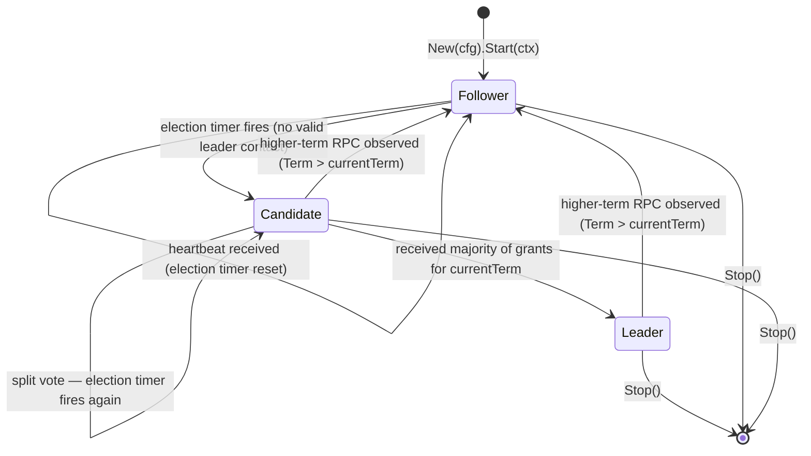

# ToyRaft — High-Level Design

**Status:** Accepted (Phase 1 contract)
**Date:** 2026-06-18
**Scope:** project-wide; architectural decomposition for v1

Sourced from `.planning/research/ARCHITECTURE.md` (§Component Map, §Suggested Build Order, §Directory Layout) and `.planning/ROADMAP.md` (phase preface).

This document captures the **architectural decomposition** and **build-order rationale**. It is the bridge between `docs/PRD.md` (what we ship and to whom) and `docs/LLD.md` (the exact interface shapes). Method signatures are deliberately deferred — they belong in LLD.

---

## Component map

ToyRaft decomposes along a strict **core / plug-in / driver** axis. The **core** is single-threaded and deterministic. The **plug-ins** are interfaces the consumer satisfies. The **driver** (`Node`) owns the goroutine that ticks the core and shuttles messages between core and plug-ins.

| Component | Layer | Responsibility | Goroutines |
|---|---|---|---|
| `raft` (core) | pure / sync | Deterministic state machine: server role (Follower/Candidate/Leader), log invariants, election & commit rules. Emits `Ready{}` messages and outbound RPCs. No I/O, no goroutines, no clock. | 0 |
| `Node` | driver | The runtime wrapper. Owns the tick loop, fans messages between Transport, Storage, StateMachine, and core. Public type consumers hold. | 1 main + N short-lived for apply/persist |
| `Log` | core | In-memory log slice (entries since last snapshot) + commit/applied indices + term/index lookup. Backed by `LogStorage`. | 0 |
| `State` / `HardState` | core | `currentTerm`, `votedFor`, `commitIndex`, `lastApplied`, role, leaderID, election timeout deadline. `HardState` (term + vote + commit) is the durably-persisted subset. | 0 |
| `ElectionTimer` | driver | Randomised timeout (e.g. `electionTick ∈ [10, 20]` ticks) that fires `MsgElect` into the core when no valid leader contact. | 0 (tick-driven) |
| `HeartbeatTimer` | driver (leader) | Fires every `heartbeatTick` ticks while role == Leader; causes core to emit empty `AppendEntries` to each peer. | 0 (tick-driven) |
| `Clock` / `Ticker` | plug-in | Abstracts time. Production = wall clock at `tickInterval` (e.g. 10ms). Tests = manual `FakeClock.Advance()`. | 1 (real) / 0 (fake) |
| `Transport` | plug-in | Send/receive Raft RPCs to/from peers. Two impls: HTTP/JSON (`pkg/transport/http`) and in-process channels (`pkg/transport/inproc`). | 1 listener + N senders |
| `StateMachine` | plug-in (consumer-owned) | Apply committed entries; optionally Snapshot/Restore. The KV in the demo lives here. | called from Node's apply goroutine |
| `Storage` | plug-in | `LogStorage` (append/truncate/range/lastIndex) + `StateStorage` (save/load `HardState`). Two impls: in-memory and file-backed (append-only). | 0 |
| `RPCs` | core types | `RequestVote{Req,Resp}`, `AppendEntries{Req,Resp}`. v1: no `InstallSnapshot`. | — |
| `Propose` API | driver | `node.Propose(ctx, []byte) (index, term, error)` — leader-only entry point for clients. Returns when entry is committed & applied, or error if leadership lost. | — |
| HTTP node-RPC server | demo | Exposes `/raft/message` for the HTTP transport, plus demo-only `/kv/*`. | 1 |
| `cmd/toyraft-demo` | driver app | Wires N nodes with HTTP transport + file storage + KV state machine. | — |
| `cmd/toyraft-ctl` | driver app | Client CLI: `put`, `get`, `status`, `leader`, `stepdown` against the demo's HTTP. | — |

**Key boundary rule:** core knows nothing about HTTP, JSON, files, or wall time. Swap any plug-in without touching core. This is what makes the chaos and linearizability test layers tractable.

Source: `ARCHITECTURE.md` §Component Map.

---

## Role FSM

Every node is in exactly one of three roles at any moment: **Follower**, **Candidate**, **Leader**. Transitions are triggered by election timeouts, vote quorums, higher-term RPCs, and external `Stop`.



**Transition triggers:**

| From | To | Trigger | Side effects |
|---|---|---|---|
| Follower | Candidate | Election timer fires without a valid `AppendEntries` from current term's leader | `Term++`, `VotedFor=self`, persist `HardState` (fsync), fan-out `RequestVote` |
| Candidate | Leader | Quorum of vote grants received for `currentTerm` (incl. self-vote) | Initialise `nextIndex[p]=lastIndex+1`, `matchIndex[p]=0` for all peers; emit empty `AppendEntries` (heartbeat); start heartbeat timer |
| Candidate | Candidate | Election timer fires before quorum reached (split vote) | `Term++`, `VotedFor=self`, persist `HardState`, restart election with fresh randomised timeout |
| Leader/Candidate | Follower | Any RPC observed with `Term > currentTerm` | `currentTerm = Term`, `VotedFor = nil`, persist `HardState`, role = Follower (uniform `maybeStepDown` path) |
| Follower | Follower | `AppendEntries` from current-term leader (any success or rejection) | Reset election timer; do not change role |

**Invariant:** all `HardState` mutations (`Term`, `VotedFor`) are fsynced **before** sending the RPC that depends on the new state. The driver enforces this — core emits messages via `Ready{}`, the driver persists then sends.

Source: `ARCHITECTURE.md` §Data Flow — Election; Raft paper §5.

---

## Plug-in / core / driver axis

ToyRaft's architecture is intentionally three-layered. Each layer has a different concurrency profile, testability profile, and ownership.

```
┌──────────────────────────────────────────────────────────────┐
│  Consumer plug-ins (interfaces YOU implement)                │
│  ─────────────────────────────────────────────               │
│   • StateMachine   — Apply / Snapshot / Restore              │
│   • Storage        — LogStorage + StateStorage               │
│   • Transport      — Send / Register / Close                 │
│                                                              │
│  We also SHIP plug-in implementations:                       │
│   • storage/memory, storage/file                             │
│   • transport/inproc (tests), transport/http (production)    │
│   • kvsm (reference state machine for the demo)              │
└──────────────────────────────────────────────────────────────┘
                              ▲
                              │ interface calls (sync)
                              ▼
┌──────────────────────────────────────────────────────────────┐
│  Core: pkg/raft  (pure state machine — NO I/O, NO clock)     │
│  ─────────────────────────────────────────────               │
│   • Log, HardState, Role, Term, Index, Entry, Message        │
│   • stepFollower / stepCandidate / stepLeader transitions    │
│   • Quorum + commit-index advancement                        │
│   • Election restriction (§5.4.1) + current-term commit rule │
│     (§5.4.2, Figure 8 fix)                                   │
│  Emits Ready{} batches: { HardState to persist, Entries to   │
│  append, Messages to send, CommittedEntries to apply }.      │
└──────────────────────────────────────────────────────────────┘
                              ▲
                              │ core.Step(msg) / Ready{}
                              ▼
┌──────────────────────────────────────────────────────────────┐
│  Driver: Node  (the runtime — owns goroutines + tick loop)   │
│  ─────────────────────────────────────────────               │
│   • Tick loop drives Clock.NewTicker → core.tick()           │
│   • Persists HardState + log via Storage before sending RPCs │
│   • Calls Transport.Send for outbound Messages               │
│   • Applies committed entries to StateMachine via channel    │
│   • Notifies pending Propose waiters on commit-and-apply     │
│   • Shutdown ordering: cancel ctx → drain apply → close      │
│     transport → join tick loop → close storage               │
└──────────────────────────────────────────────────────────────┘
```

**Rationale:**

- **Pure core = trivially testable.** Every property test, every Figure-7 scenario, every Figure-8 leader-churn case runs in microseconds with no goroutines and no fake clock.
- **Driver owns I/O = swappable transport & storage.** The same core runs identically against `inproc + memory` (tests) and `http + file` (production).
- **Consumer-owned StateMachine = ToyRaft is a library, not a framework.** The consumer brings their domain model; ToyRaft owns consensus.

Exact interface signatures (method shapes, parameter types, error contracts, invariants) are locked in `docs/LLD.md`. This document only commits the **layering rule** — that core never imports a plug-in concrete type, and the driver never bypasses the core's `Ready{}` discipline. Drift is a review-blocking finding (Working Agreement 4).

Source: `ARCHITECTURE.md` §Component Map (boundary rule); `SUMMARY.md` §2 (SDK shape).

---

## Build-order rationale

ToyRaft v1 ships across 14 phases. The order is **architecturally imposed**, not arbitrary. The hard chain is:

```
1 → 2 → 3 → 4 → 5 → 6 → 7        (foundations through library API)
                         ↘
                          8 ∥ 9    (storage/file and HTTP transport in parallel)
                         ↗
                         10 → 11 → 12   (demo, chaos, linearizability — the v1 acceptance gate)
                         13, 14         (polish: netns chaos, release)
```

| # | Phase | Branch | Why this order |
|---|---|---|---|
| 1 | Specs & Contracts | `feature/specs-and-contracts` | Lock the contract (PRD/HLD/LLD/WIRE/...) before any code. Working Agreement 4 ("specs are source of truth") requires this. |
| 2 | Foundations (Types + Log) | `feature/foundations` | Pure data types (`Entry`, `Message`, `Role`, in-memory `Log`). Zero dependencies. Table-tested for log matching and conflict detection. |
| 3 | Storage Interface + Memory Impl | `feature/storage-interface` | Need a `Storage` impl before the core can be exercised. Memory impl is the conformance reference for `storage/file` later. |
| 4 | Test Infrastructure (FakeClock + inproc Hub) | `feature/test-infra` | **Built before the core.** This inverts the obvious order but is the single most important productivity decision: every test of the core then runs in microseconds, deterministically, with no real network or wall clock. Same pattern as `etcd/raft`. |
| 5 | Election (Follower + Candidate) | `feature/election` | Smallest unit that produces observable cluster behaviour (~300 LOC). Leader election with no log is the minimum viable consensus slice. |
| 6 | Replication + Commit (Leader) | `feature/replication` | The actual consensus. `Propose` works end-to-end against inproc + memory + a trivial counter SM. Includes the Figure 8 current-term commit rule. |
| 7 | Library API (Node + Driver + Apply channel) | `feature/library-api` | Wraps core into the public `Node` surface. Locks the `Ready{}` flow + apply channel + Propose-waiter semantics. |
| 8 ‖ | storage/file | `feature/storage-file` | Parallel with 9; depends only on the stable `Storage` interface from phase 3. Append-only log + fsynced HardState via tmp+rename. |
| 9 ‖ | HTTP Transport | `feature/http-transport` | Parallel with 8; depends only on the stable `Message` type from phase 2. `/raft/message` server + JSON client + leader-hint redirect. |
| 10 | Reference Demo (kvsm + toyraftd + toyraftctl) | `feature/reference-demo` | Last piece. Integrate everything end-to-end. KV state machine + demo HTTP for clients + ctl CLI. |
| 11 | Seeded Chaos Suite | `feature/chaos-suite` | Exercise inproc + HTTP under partitions, drops, delays. Surfaces crash/liveness bugs cheaply before linearizability runs. |
| 12 | Linearizability Verification | `feature/linearizability` | **v1 acceptance gate.** Porcupine-style checker fed by `kvsm` client history. Green on N=3, 5, 7. |
| 13 | iptables / netns Chaos (linux-only) | `feature/netns-chaos` | Polish: real network-layer chaos catches bugs the inproc proxy can't reach. |
| 14 | Observability, ADRs, README, Release | `feature/release` | Polish: metrics endpoints, ADR backfill, demo Prometheus/Grafana, GoReleaser, journal sweep. |

**Three rationale highlights** (lifted from `ARCHITECTURE.md` §Suggested Build Order):

- **Phase 4 before phase 5.** FakeClock + Hub before the core means every test of the core then runs deterministically without real time or network. Productivity multiplier.
- **Election before replication.** Smallest observable cluster behaviour, ~300 LOC. Bolting replication onto a working election is additive, not invasive.
- **Chaos before linearizability.** Chaos surfaces cheap bugs. Linearizability needs a mostly-correct system to be useful; running it on a broken impl floods you with violations you already knew about.

Per-phase success criteria, deliverables, and risk-retirement live in `.planning/ROADMAP.md`. This document is the "why this order"; the roadmap is the "what each phase ships".

Source: `ARCHITECTURE.md` §Suggested Build Order; `ROADMAP.md` phase preface.

---

## Directory layout

Grounded in `toykv` / `toymq` house style, adjusted for **library-first**: anything a consumer imports lives under `pkg/`; anything internal-only lives under `internal/`.

```
toyraft/
├── cmd/
│   ├── toyraft-demo/           # reference N-node (default 3) cluster
│   │   └── main.go             # wires raft + http transport + file storage + KV
│   └── toyraft-ctl/            # client CLI: put/get/status/leader/stepdown
│       └── main.go
│
├── pkg/                         # PUBLIC SURFACE — semver-stable
│   ├── raft/                   # the consensus core (THE product)
│   │   ├── doc.go              # package-level docs + usage example
│   │   ├── config.go           # Config, validate
│   │   ├── node.go             # Node interface, New(), Start/Stop/Propose/Step/Status
│   │   ├── core.go             # pure state machine: stepLeader/Follower/Candidate
│   │   ├── log.go              # in-memory log slice, matching, commit calc
│   │   ├── state.go            # Role, HardState, soft state
│   │   ├── message.go          # Message, Entry, MessageType
│   │   ├── progress.go         # leader's nextIndex/matchIndex per peer
│   │   ├── errors.go
│   │   └── clock.go            # Clock interface + RealClock
│   │
│   ├── transport/
│   │   ├── http/               # HTTP/JSON transport
│   │   │   ├── transport.go
│   │   │   ├── server.go       # http.Handler for /raft/message
│   │   │   └── client.go
│   │   └── inproc/             # in-memory hub for tests/sim
│   │       ├── hub.go
│   │       ├── transport.go
│   │       └── chaos.go        # partition/drop/delay knobs
│   │
│   ├── storage/
│   │   ├── memory/             # in-RAM Storage
│   │   └── file/               # append-only log + fsynced hardstate
│   │       ├── log.go
│   │       └── hardstate.go
│   │
│   └── kvsm/                   # reference KV state machine for the demo
│       ├── sm.go               # implements raft.StateMachine
│       └── cmd.go              # Put/Get/Delete command encoding
│
├── internal/                    # not importable; implementation details
│   ├── clock/                  # FakeClock for deterministic tests
│   ├── encoding/               # length-prefix framing helpers, JSON helpers
│   └── testcluster/            # spin up N inproc nodes for unit tests
│
├── test/
│   ├── chaos/                  # 3 chaos approaches (jepsen-lite, fault injector, partition matrix)
│   ├── linearizability/        # Porcupine-style history checker over kvsm
│   └── e2e/                    # full HTTP demo, kill -9 nodes
│
├── docs/
│   ├── adr/                    # 0000-record-architecture-decisions.md, 0001-..., ...
│   ├── rfc/                    # 0001-v1-scope-and-non-goals.md, ...
│   └── (PRD, HLD, FLOWS, LLD, WIRE, CONCURRENCY, TESTING, SECURITY,
│        GLOSSARY, CONTRIBUTING, RELEASE_PLAN, PROCESS).md
│
├── .journal/                   # per-phase journals (M1.md, M2.md, ...)
├── .github/
│   └── pull_request_template.md
├── observability/              # demo Prometheus/Grafana (matches toymq)
├── Makefile
├── go.mod
├── README.md
├── CHANGELOG.md
└── CLAUDE.md
```

**Rationale for choices that differ from toykv/toymq:**

- `pkg/raft/` is THE product — toykv/toymq's equivalent `internal/store` and `internal/broker` are deliberately hidden because they aren't libraries. ToyRaft's core must be exported.
- `pkg/transport/{http,inproc}` are siblings, not nested under `raft/`, so consumers can import them à la carte.
- `pkg/kvsm/` is a *demo state machine*, not an internal one — exporting it makes it documentation-as-code: "this is how you write a state machine."
- `internal/testcluster` is the only internal package shared cross-`pkg/`, matching `toymq`'s `internal/integration`.

Source: `ARCHITECTURE.md` §Directory Layout.

---

## Cross-references

- Sequence flows (election, client write, heartbeat/catch-up): `docs/FLOWS.md`
- Exact interface signatures + invariants: `docs/LLD.md` (lands later in this phase)
- HTTP wire format: `docs/WIRE.md` (lands later in this phase)
- Concurrency model (goroutine census, lock hierarchy, shutdown): `docs/CONCURRENCY.md` (lands later in this phase)
- Per-phase deliverables + success criteria: `.planning/ROADMAP.md`
- Build-order narrative + alternative orderings considered: `.planning/research/ARCHITECTURE.md` §Suggested Build Order
